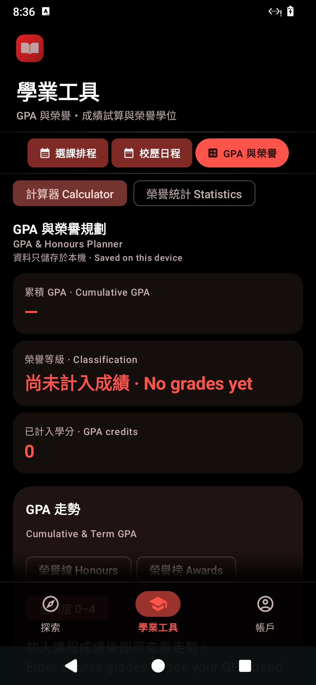
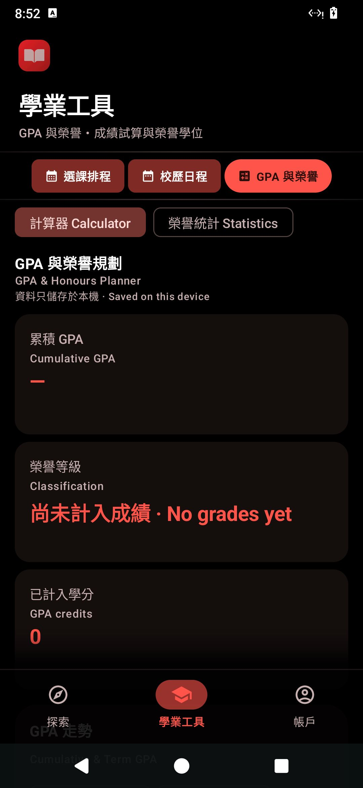
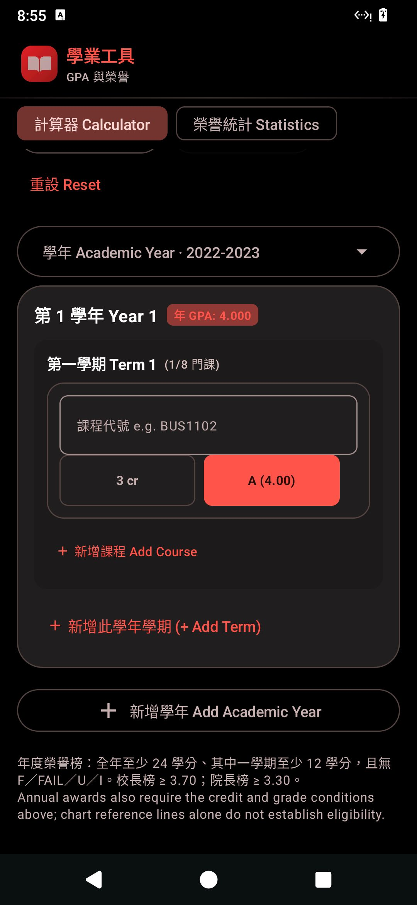
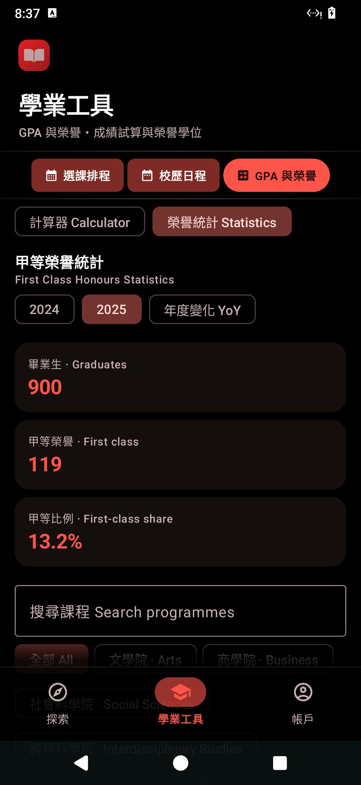
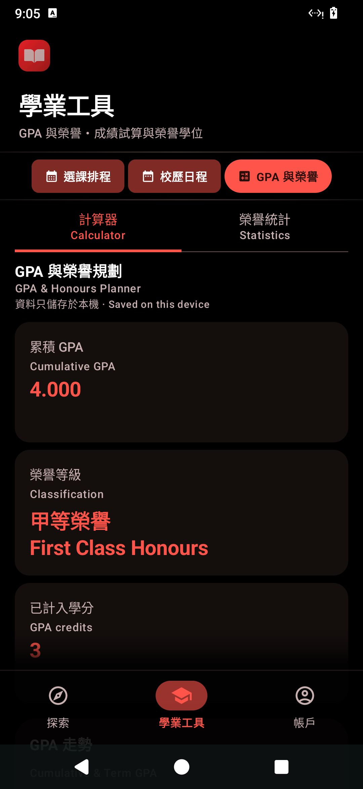
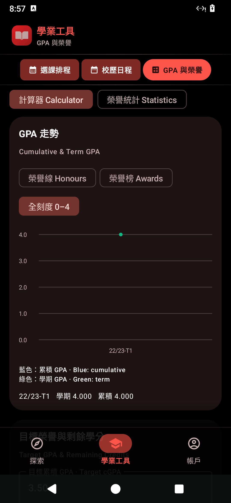

<div align="center">


# LingUBible Android 📱
### *嶺南大學課程與講師評價 · 官方原生 Android 應用*
### *Official Native Android Client for LingUBible*

[-3DDC84?style=flat-square&logo=android&logoColor=white)](https://developer.android.com)
[](https://kotlinlang.org)
[](https://developer.android.com/jetpack/compose)
[](https://appwrite.io)
[](https://insert-koin.io)
[](https://github.com/ricky688/LingUBible_android)
[](LICENSE)

<br/>

**LingUBible Android** 是專為嶺南大學（Lingnan University）學生量身打造的現代化原生 Android 應用程式。採用 **Jetpack Compose** 與 Google 最新 **Material 3 Expressive (M3E)** 設計語言構建，結合流暢的彈簧物理動效（Spring Motions）、毛玻璃質態（Glassmorphism）、雙語介面規範，並與 [LingUBible Web App](https://www.lingubible.com) 資料庫全面互通，為嶺大學子提供極致流暢的修課心得查閱、選課排程、行事曆與 GPA 榮譽規劃體驗。

[✨ 核心功能](#-核心功能-features) • [📱 介面預覽](#-介面展示-screenshots) • [🏗️ 技術架構](#%EF%B8%8F-技術架構-architecture) • [🚀 快速開始](#-快速開始-quick-start) • [🧪 測試驗證](#-測試與驗證-testing) • [📄 授權條款](#-授權條款-license)

</div>

---

## ✨ 核心功能 (Features)

### 🎓 1. 學術工具：GPA & 榮譽規劃 (GPA & Honours Planner)
- **計算器 (Calculator Tab)**：
  - **動態數據滾輪 (Numeric Roll Transitions)**：累計 GPA (cGPA)、學期 GPA、學分總計均配備直向平滑數字滾動動效 (`AnimatedContent` + Spring Physics)。
  - **榮譽等級動態橫幅**：自動計算並判定榮譽等級（甲等榮譽 First Class Honours、乙等一級、乙等二級、丙等等），支援動態勳章圖標。
  - **目標 GPA 模擬器 (Target Simulator)**：自訂目標 GPA 與剩餘學分，提供一鍵捷徑（如甲等 3.50、乙一 3.00），即時推算剩餘課程所需平均成績。
  - **多學年課程編輯器**：支援新增/刪除多學期與多學年、自動補全課程代碼、全功能 **復原 (Undo) / 重做 (Redo) / 重設 (Reset)** 歷史紀錄棧。
- **榮譽統計 (Statistics Tab)**：
  - **官方畢業數據庫**：內建嶺南大學 30 個學系/課程於 2024 與 2025 年之官方畢業數據（畢業總人數、一級榮譽人數與比例）。
  - **多維度篩選與比較**：支援依學院（文學院、商學院、社會科學院、數據科學院等）分組過濾、搜尋、年度 YoY 增減百分比對比。

### 📅 2. 學術行事曆 (Academic Calendar & Web Parity)
- **月視圖與週視圖**：與 Google Calendar 及 LingUBible Web 版一致的月視圖設計，單日格子直接顯示分類色彩事件標籤（Holiday、Teaching、Exam 等）。
- **完整學術日程**：即時同步嶺南大學官方重要時程（開學、Add/Drop 期、考試週、放假等），支援點擊查看詳細說明與單日事件清單。

### 🗓️ 3. 課表排程規劃 (Timetable Planner)
- **可展開式課程類別面板**：從緊湊滾動條平滑展開為多欄學院類別網格，點擊即時篩選課程。
- **衝突偵測與視覺化**：自選課程節次 (Sections)，自動檢測時段衝突，自訂色彩標記。
- **行事曆匯出**：支援一鍵產生標準 `.ics` 檔案，無縫匯入 Google Calendar、Apple Calendar 等。

### 🔍 4. 探索與課程／講師庫 (Discover & Directory)
- **全方位智慧搜尋**：支援課程代碼（如 `CLC9001`、`BUS1102`）、中英文名稱、講師全名與常見學生暱稱搜尋。
- **毛玻璃頂欄 (Frosted Glass Header)**：支援動態漸變邊框、頂部微光反光與大氣微暈效果，滾動時底層內容優雅穿透。
- **Vico 互動式成績分佈圖表**：以長條圖視覺化呈現過往修課同學成績分佈 (A、B、C 等級佔比)。

### ✍️ 5. 真實課程評價與社群審核 (Course Reviews)
- **多維度客觀評分**：涵蓋 Workload（工作量）、Difficulty（難度）、Grade（給分寬容度）與 Teaching（教學品質）。
- **社群互動**：支援對心得進行實用/非實用 (Helpful/Unhelpful) 投票。
- **防呆與單行優化表單**：採用 Step-by-Step 引導式填寫，所有欄位均經過嚴格之單行與防折行優化，標籤與 Placeholder 職責清晰分離。

### 🔐 6. 學生驗證與隱私安全 (Authentication & Profile)
- **嶺南大學校園郵箱驗證**：僅限 `@ln.hk` 與 `@ln.edu.hk` 學生註冊與登入。
- **收藏與個人化**：即時雲端同步使用者收藏之課程與講師列表，安全保存個人課表。

---

## 📱 介面展示 (Screenshots)

<div align="center">

| GPA 計算器 (Calculator) | 目標 GPA 模擬器 (Target Simulator) |
|:---:|:---:|
|  |  |

| 課程與學期編輯器 (Course Editor) | 官方榮譽畢業統計 (Honours Statistics) |
|:---:|:---:|
|  |  |

| 等寬分頁與 Material 3 主題 (Themed Tabs) | 成績分佈圖表 (Grade Visualizer) |
|:---:|:---:|
|  |  |

</div>

---

## 🎨 設計規範：Material 3 Expressive (M3E)

LingUBible Android 遵循官方最新 **Material 3 Expressive** 標準進行設計與實現：

1. **純彈簧物理動效 (Pure Spring Motion Tokens)**：
   - 統一使用 `spring(stiffness = Spring.StiffnessMediumLow)` 與 `MotionScheme.expressive()`。
   - **嚴格禁止覆寫 damping ratios**，呈現自然且富有彈性的回彈手感。
2. **微光毛玻璃質感 (Frosted Glassmorphism)**：
   - 半透明表面層 (`surface.copy(alpha = 0.70f ~ 0.85f)`)。
   - 細緻線性高光邊框 (`Brush.verticalGradient`)、頂部鏡面反光 (Top Sheen) 與大氣放射微暈 (Radial Glow)。
3. **富有表現力的超橢圓曲率 (Expressive Squircles)**：
   - 採用 `14.dp` ~ `24.dp` 圓角超橢圓卡片與按鈕容器，支援狀態切換時的形狀形變動效。
4. **文字輸入框單行保護規範**：
   - 所有 `OutlinedTextField` 之 `label` 與 `placeholder` 均嚴格配置 `maxLines = 1` 與 `TextOverflow.Ellipsis`。
   - 範例格式提示（如 `@ln.hk`、`例: CLC9001`）一律獨立於 `placeholder` 中，確保空白狀態下標籤絕對不折行。
5. **雙語視覺階級 (Bilingual Hierarchy)**：
   - 繁體中文為主標題，英文為次標題，清晰展示嶺南大學全英語教學環境下的雙語資訊。

---

## 🏗️ 技術架構 (Architecture)

本專案遵循現代 Android 開發的最佳實踐（Clean Architecture + MVVM + Repository Pattern）：

```
LingUBible_android/
├── app/
│   ├── src/main/java/com/lingubible/app/
│   │   ├── core/                    # 核心主題、導航路由、設定、動效 Token、i18n 工具
│   │   │   ├── navigation/          # NavGraph, BottomBar, TopBar, Drawer
│   │   │   ├── settings/            # AppSettingsManager (DataStore)
│   │   │   ├── theme/               # Theme, Color, Type, TactileMotionTokens
│   │   │   └── util/                # I18n, IcsExporter
│   │   ├── data/                    # 資料層實作 (Data Sources & Repositories)
│   │   │   ├── remote/              # AppwriteClientProvider (Appwrite 2.0 SDK)
│   │   │   └── repository/          # Auth, Course, Instructor, Review, Calendar, Timetable
│   │   ├── di/                      # 依賴注入 (Koin Module Definitions)
│   │   ├── domain/                  # 領域層 (Models, Repository Interfaces, Use Cases)
│   │   │   ├── calculator/          # HonoursCalculator (GPA 演算法與榮譽等級評定)
│   │   │   ├── model/               # Domain Entity Models
│   │   │   └── repository/          # Repository Interfaces
│   │   └── ui/                      # 表現層 (Jetpack Compose UI)
│   │       ├── common/              # 共用 ViewModel 與 Modifier
│   │       ├── components/          # M3E 組件 (GpaDashboard, FrostedGlass, Charts, Selector)
│   │       └── screens/             # 功能畫面 (Home, Courses, Planner, Calendar, Gpa, Auth)
│   └── src/test/                    # 單元測試套件 (DomainAndViewModelTest, GpaHonsViewModelTest)
```

### 🧰 技術棧一覽

| 領域 / 組件 | 技術選擇 | 版本 | 說明 |
|:---|:---|:---|:---|
| **語言** | Kotlin | `2.0.0` | 支援協程、高階函式與型別安全 |
| **UI 框架** | Jetpack Compose | BOM `2026.09.00` | 宣告式原生 UI 構建 |
| **設計系統** | Material 3 Expressive | `1.5.0-alpha01` | M3E 實驗性表現力組件與動效 |
| **依賴注入** | Koin | `4.0.0` | 輕量且適用於 Compose 的 DI |
| **後端服務 (BaaS)** | Appwrite Android SDK | `27.2.0` | 負責 Auth、TablesDB 資料庫、Storage 與 Functions |
| **資料視覺化** | Vico Charting | `2.0.2` | 成績分佈直方圖與趨勢分析圖表 |
| **非同步處理** | Kotlin Coroutines & Flow | `1.8.1` | 響應式狀態流與並發處理 |
| **圖片載入** | Coil Compose | `2.7.0` | 非同步圖片載入與快取 |
| **單元測試** | JUnit 4 + MockK + Turbine | 最新 | 覆蓋 GPA 演算、狀態處理與 Undo/Redo 歷史棧 |

---

## 🚀 快速開始 (Quick Start)

### 環境需求
- **Android Studio**：Ladybug (2024.2.1) 或更新版本
- **JDK**：Java 17
- **Android SDK**：
  - `compileSdk`: 35 (Android 15)
  - `targetSdk`: 35
  - `minSdk`: 26 (Android 8.0 Oreo 以上)

### 1. 複製專案
```bash
git clone https://github.com/ricky688/LingUBible_android.git
cd LingUBible_android
```

### 2. 環境配置 (Appwrite)
專案預設已配置官方生產環境 Appwrite 端點：
- **Endpoint**: `https://appwrite.lingubible.com/v1`
- **Project ID**: `6a1097400037a55f6472`
- **Database ID**: `lingubible`

*(如需切換至自建 Appwrite 伺服器，可於 `app/build.gradle.kts` 中調整 `buildConfigField` 參數)*

### 3. 編譯與安裝 Debug APK
```bash
# 設定 Android SDK 路徑 (若環境變數已設定則可略過)
export ANDROID_HOME=/path/to/android-sdk

# 編譯 Debug 版本 APK
./gradlew :app:assembleDebug

# 透過 ADB 安裝至連接的手機或模擬器
adb install -r app/build/outputs/apk/debug/app-debug.apk
```

---

## 🧪 測試與驗證 (Testing)

本專案具備完善的離線單元測試與 ViewModel 測試套件，涵蓋所有 GPA 榮譽等級計算規則、目標學分模擬推算、歷史紀錄 Undo/Redo 棧以及資料層轉換邏輯。

執行完整單元測試：
```bash
./gradlew :app:testDebugUnitTest --console=plain
```

- **測試結果**：**335 個單元測試全數通過**，0 個失敗、0 個錯誤。
- **實機驗證**：已於 Android 13/14 實體裝置及 Waydroid 虛擬環境完成全流程功能驗證與 UI 截圖檢驗。

---

## 🤝 參與貢獻 (Contributing)

歡迎為 LingUBible Android 貢獻程式碼或提出建議！
1. Fork 本專案至您的 GitHub 帳號。
2. 建立您的特性分支：`git checkout -b feature/awesome-feature`。
3. 遵循專案之 Material 3 Expressive 設計規範與單元測試標準。
4. 提交您的變更：`git commit -m '✨ 新增某某功能'`。
5. 推送至分支：`git push origin feature/awesome-feature`。
6. 開啟一個 Pull Request。

---

## 📄 授權條款 (License)

本專案採用 [MIT License](LICENSE) 條款開源授權。

---

<div align="center">

**Made with ❤️ for all Lingnan University Students**  
*Let every review be a guiding light on your learning journey.*

</div>
